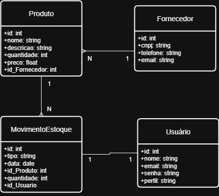

# Gerenciador de Estoque

Esse repositório foi criado para a produção do projeto proposto na disciplina "Desenvolvimento Web", tendo como objetivo a criação de um sistema de gerenciamento de estoque para pequenos negócios. O sistema permite controlar a entrada e saída de produtos, fornecedores e níveis de estoque de forma simples e prática.

## Tecnologias Utilizadas

- Java 17  
- Spring Boot 3.x  
- Thymeleaf  
- JPA / Hibernate  
- Maven  
- Bean Validation (Jakarta Validation)

## Estrutura do Projeto

- `controller.view` → Controllers que gerenciam as views do sistema.  
- `controller.restapi` → Controllers que fornecem endpoints REST (JSON).  
- `services` → Contém a lógica de negócio.  
- `entities` → Classes de domínio mapeadas como tabelas no banco.  
- `dto` → Objetos para transferência de dados entre a camada web e a camada de serviço (Data Transfer Objects), utilizados para receber dados de formulários e aplicar validações.  
- `templates` → Arquivos HTML das views (Thymeleaf).  
- `static` → Recursos estáticos como CSS, JavaScript e imagens.  

## Como Executar

1. Clone o repositório:

   git clone https://github.com/seu-usuario/gerenciador-estoque.git
   cd gerenciador-estoque
2. Instale as dependências e rode o projeto:

    mvn clean install
    mvn spring-boot:run
3. Acesse a aplicação no navegador:

    http://localhost:8080/principal

## Diagrama de Classes 

Funcionalidades Implementadas (P1)

CRUD de Produtos (mockado, sem banco real)

CRUD de Usuários (mockado)

CRUD de Fornecedores (mockado)

Visualização de detalhes de cada entidade

Layout base com navegação entre telas